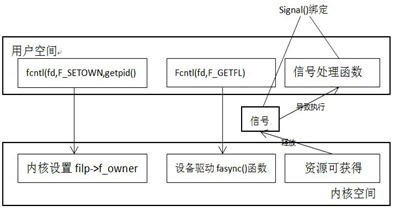

##Linux kernel 异步通知和异步IO

阻塞I/O意味着一直等待设备可访问再访问，非阻塞I/O意味着使用poll()来查询是否可访问，而异步通知则意味着设备通知应用程序自身可访问。（异步通知：很简单，一旦设备准备好，就主动通知应用程序，这种情况下应用程序就不需要查询设备状态，这是不是特像硬件上常提的“中断的概念”。上边比较准确的说法其实应该叫做“信号驱动的异步I/O”,信号是在软件层次上对中断机制的一种模拟。）为了实现异步通知，驱动层和应用层都要做工作：

###应用层

1. 利用signal或者sigaction设置SIGIO信号的处理函数
2. fcntl的F_SETOWN指令设置当前进程为设备文件owner
3. fcntl的F_SETFL指令设置FASYNC标志

     
以下是应用程序的代码：

	#include <sys/types.h>
    #include <sys/stat.h>
    #include <stdio.h>
    #include <fcntl.h>
    #include <signal.h>
    #include <unistd.h>

    #define MAX_LEN 100

    //处理函数，没什么好讲的，用户自己定义
    void input_handler(int num)
    {
        char data[MAX_LEN];
        int len;    
        //读取并输出STDIN_FILENO上的输入
        len = read(STDIN_FILENO, &data, MAX_LEN);
        data[len] = 0; 
        printf("input available:%s\n", data);
    }

    void main()
    {
        int oflags;

        //启动信号驱动机制,将SIGIO信号同input_handler函数关联起来,一旦产生SIGIO信号,就会执行input_handler
        signal(SIGIO, input_handler);    

        //STDIN_FILENO是打开的设备文件描述符,F_SETOWN用来决定操作是干什么的,getpid()是个系统调用，
        //功能是返回当前进程的进程号,整个函数的功能是STDIN_FILENO设置这个设备文件的拥有者为当前进程。
        fcntl(STDIN_FILENO, F_SETOWN, getpid());    

        //得到打开文件描述符的状态
        oflags = fcntl(STDIN_FILENO, F_GETFL);

        //设置文件描述符的状态为oflags | FASYNC属性,一旦文件描述符被设置成具有FASYNC属性的状态，
        //也就是将设备文件切换到异步操作模式。这时系统就会自动调用驱动程序的fasync方法。
        fcntl(STDIN_FILENO, F_SETFL, oflags | FASYNC);  

        //最后进入一个死循环，程序什么都不干了，只有信号能激发input_handler的运行
        //如果程序中没有这个死循环，会立即执行完毕
        while (1);
    }

###驱动层

1. 在设备抽象的数据结构中增加一个struct fasync_struct的指针
2. 实现设备操作中的fasync函数，这个函数很简单，其主体就是调用内核的fasync_helper函数。
3. 在需要向用户空间通知的地方(例如中断中)调用内核的kill_fasync函数。
4. 在驱动的release方法中调用前面定义的fasync函数

需要在驱动程序中增加以下内容：

    //首先是定义一个结构体，其实这个结构体存放的是一个列表，这个
    //列表保存的是一系列设备文件，SIGIO信号就发送到这些设备上
    static struct fasync_struct *fasync_queue;

    //fasync方法的实现， 该方法要写到file_operations结构体中
    static int my_fasync(int fd, struct file * filp, int on)
    {
        int retval;  
        //将该设备登记到fasync_queue队列中去
        retval=fasync_helper(fd,filp,on,&fasync_queue);  
        if(retval<0)
        {
            return retval;
        }
        return 0;
    }

	/*一旦设备资源可以获得时,应该调用kill_fasync()释放SIGIO信号,可读时第三个参数设置为POLL_IN,可写时第三个参数设置为POLL_OUT,下边是释放信号的典型模版：*/
	
	static ssize_t xxx_write(struct file *filp, const char __user *buf, size_t count,loff_t *f_ops)
	{
	  struct xxx_dev *dev = filp->private_data;
	     ....
	     //产生异步信号
	  if(dev->async_queue)
	  {
	     kill_fasync(&dev->async_queue, SIGIO, POLL_IN);
	  }
	  ..
	}
	
	/*最后，在文件关闭时，即在设备驱动的release函数中，应调用设备驱动的fasync()函数将文件从异步通知的列表中删除，下边是设备驱动的释放函数的典型模版:*/
	
	static int xxx_release(struct inode *inode, struct file *filp)
	{
	    struct xxx_dev *dev = filp->private_data;
	    //将文件从异步通知列表中删除
	  xxx_fasync(-1,filp,0);
	    ...
	    return 0;
	}

###备注：

当有多个文件发送异步通知信号给一个进程时，进程无法知道是哪个文件发送的信号，这时候还是要借助poll的帮助完成IO