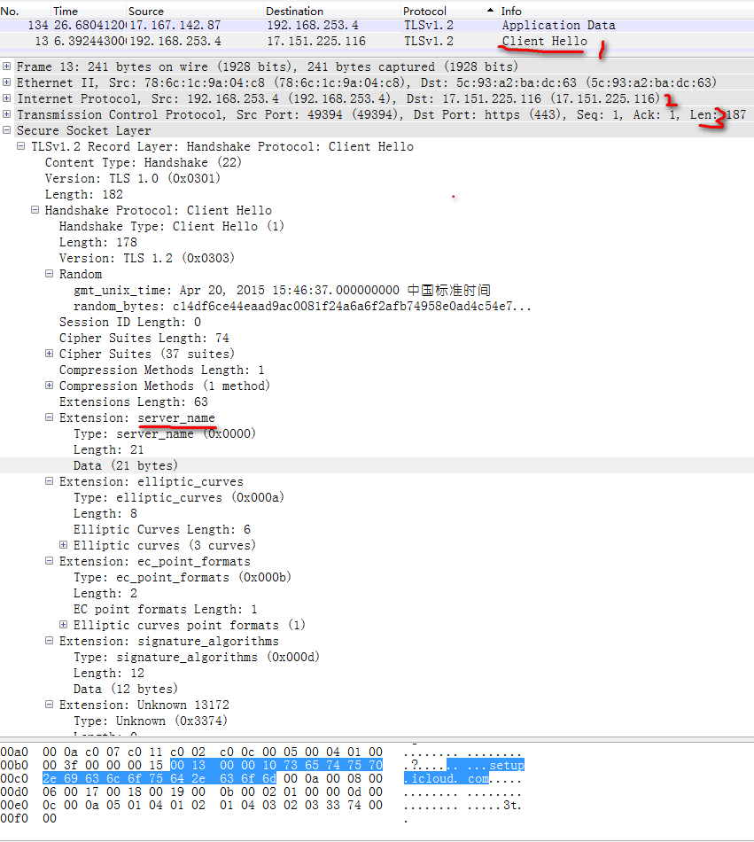

##netfiter实现解析TLS数据包

苹果的终端连接上网络后，终端会和后台会有很多数据交互，这些数据基本上都是通过TLS加密的，也就说抓包的时候会发现：不能发现请求的是哪个URL，而是TLS的加密包。这种情况，要在Linux路由器上屏蔽iCloud的自动更新，是很复杂的。但是，通过Wireshark抓包的分析，还是可以在包的某个字段找到加密后的TLS包的区别。

####分析Wireshark包

笔记本电脑开一个wifi热点，然后通过Windows电脑的Wireshark软件监听wifi热点的网口，然后只让手机连接上这个wifi，这样就可以把手机终端和云端的数据交互抓取出来，截图是抓取的包的截图：

在【1】处就是抓取的终端请求的经过TLS加密的数据，但是WireShark还是解析出来一些东西的，而这些东西足够我们分析这个包有什么作用。

可以看到，【2】处和【3】处分别为IP包头和TCP包头，而这两个包头的长度可以再netfilter计算出来，而我们要解析TLS包的时候要跳过这两个包头长度，才是我们要解析TLS数据，也就是图片上的Secure Socket Layer层。